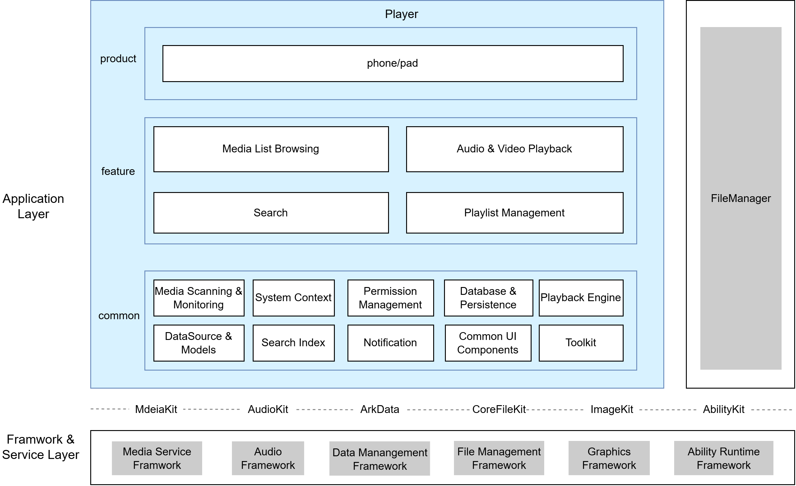

# Player

## Introduction

**Player** (package: `com.ohos.players`) is a pre-installed **system application** in OpenHarmony, providing media list browsing, audio/video playback, playlist management, and search capabilities across phone and tablet devices.

This is a system pre-installed application. Users can enter the Player from the desktop icon, File Manager's "Open with" action, and other entry points.

### Core Capabilities

**Media List Browsing**
- Automatically scans audio and video files on the device, supporting media library, sandbox, public storage, and user file scanning strategies.
- Real-time progress bar during batch import; progress notifications in background and lock-screen scenarios.
- Category tabs (All / Music / Video) with switchable grid and list layouts; sorting by size, time, or name.
- Thumbnail display for audio/video (video first frame / audio cover art); font and scaling follow system settings.
- Single-item deletion, multi-selection deletion, and swipe-to-select deletion.

**Audio / Video Playback**
- Local path playback with auto-play; tap an audio/video file to enter the corresponding playback page.
- Playback modes: Sequential, List Loop, Single Loop, Shuffle.
- Multi-speed playback with audio-video sync for video and noise-free audio.
- Automatic landscape/portrait adaptation for video without interruption; audio page supports collapsing to a mini-player bar.
- Gesture controls for brightness and volume; long-press for temporary speed boost.
- Control center (AVSession) displays cover art and playback controls, supporting background audio playback with notification bar.
- Picture-in-Picture (PiP) floating window for video playback, supporting split-screen mode.
- Auto-pause/resume on incoming calls; auto-pause/resume video on screen lock.
- Supports direct playback from File Manager's "Open with" action.

**Playlist Management**
- Create multiple named playlists with independent track maintenance.
- Multi-selection deletion and long-press drag-to-reorder within playlists.
- Playlist resume: audio playback progress is preserved after process termination.

**Search**
- Home page search entry; fuzzy keyword matching by file name based on in-memory inverted index for efficient retrieval.
- Results sorted by relevance score with highlighted matches; tap to navigate to the corresponding playback page.

## Architecture

The Player adopts a layered and modular design, organizing code by product form, business features, and common capabilities, as illustrated below:


### Application Layer Design

The overall structure is divided into three layers: Product Layer, Feature Layer, and Common Layer:

| Layer | Key Directories | Responsibilities                                     |
|------| -------------- |----------------------------------------|
| Product Layer | `entry` | Phone and tablet share the same HAP entry: hosts the application entry, main pages, Ability lifecycle, and page navigation.     |
| Feature Layer | `feature/media`, `feature/player`, `feature/search`, `feature/playlist` | Media List Browsing, Audio/Video Playback, Search, Playlist Management.     |
| Common Layer | `common` | Media scanning & monitoring, system context, permission management, database & persistence, playback engine, data source & model, search index, notifications, common UI components, utilities. |

**Product Layer Module Details**

| Directory / Component | Description |
|-------------|------|
| `abilities/` | `MainAbility` entry; hosts UIAbility lifecycle |
| `pages/` | Main page, default index page, playlist page, and other main pages |
| `pages/nav/` | NavDestination sub-pages, including audio/video/search/settings, etc. |
| `navigation/` | NavPathStack route table and page registration |
| `components/` | Home page components, including header, category tabs, floating tab bar, etc. |
| `viewmodel/` | Page-level business orchestration, including home and playlist ViewModels |
| `constants/` | Route name, view size, and other constants |
| `utils/` | External Want resolution, navigation, and other utilities |

**Feature Layer Module Details**

| Core Capability   | Key Classes       | Description                      |
|--------|----------------|-------------------------|
| Media List Browsing | MediaAggregateView, MediaAggregateViewModel, MediaViewArrayDataSource    | Media list/grid view, multi-strategy scan orchestration, filtering & sorting, multi-select delete         |
| Audio / Video Playback | AudioPage/VideoPlayPage, AVPlayerController/AudioPlayerController/VideoPlayerController, AudioPlaybackSession/VideoPlaybackSession, PlaybackCallInterruptGuard/PlaybackVideoScreenLockGuard | Audio/video playback pages, AVSession bridge, gesture interaction, PiP, call/screen-lock monitoring |
| Playlist Management | PlaylistView/PlaylistDetailView/PlaylistEditView, PlaylistAddAudioView | Playlist list/detail/edit, track add/remove/reorder, playback resume         |
| Search | SearchBar/SearchOverlay, SearchViewModel, SearchIndexCoordinator | Inverted index, relevance scoring, result highlighting              |

**Common Layer Module Details**

| Core Capability | Key Classes | Description |
|--------|------|------|
| Media Scanning & Monitoring | MediaFileScanner, ScanStateManager, ScanTaskPool, FileListenerManager, FileSyncEngine | Unifies discovery of on-device media files and maintains scan state; results are globally shared |
| System Context | AppContext, IMediaListAccess | Global singleton holding the ability context and DI bridge; unifies system resource access across features |
| Permission Management | MediaPermissionManager | Wraps system permission APIs and maintains global authorization state; ensures consistent permission requests across scenarios |
| Database & Persistence | MediaDbManager, Rdb, PlaybackHistoryManager, AppLocalStorage | Unifies the database handle and table access layer; consolidates data write entry points |
| Playback Engine | PlaybackQueueManager, PlaybackResumeContext | The playback queue and resume state are cross-page global runtime state; centralized to keep track switching and resume consistent across multiple entry points |
| Data Source & Model | MediaDataSource, IMediaDataSource, FileInfo, AudioItem, VideoItem, MediaCacheManager | Defines data models shared by all features |
| Search Index | SearchIndexManager | Builds and retrieves the inverted index; index data is maintained globally |
| Notifications | MediaProgressNotificationHelper, MediaProgressBackgroundHelper, MediaProgressLiveViewHelper | Unifies notification channels and styles |
| Common UI Components | EmptyStateView, SearchBar, NavBackButton, SwipeDeleteEndAction | Stateless presentational widgets, e.g. search box, button, composable by any page |
| Utilities | MediaMetadataResolver, SearchScorer, ThumbnailManager, DeviceConfigUtil, AppThemeConstants | Stateless pure-function utilities callable by any module, including metadata parsing, thumbnail loading, pinyin conversion cache, etc. |

### Relationship with Other Applications

System apps can invoke this app. The prerequisite is that the app is installed, and playing audio/video requires the user to grant the corresponding media permissions.

By scenario:

| Scenario | Description |
|------|---------------------------|
| User plays audio/video via File Manager "Open with" | When the user selects an audio/video file in File Manager and chooses "Open with → Player", File Manager launches this app's MainAbility via Want carrying the file URI; Player parses the URI, enters the corresponding playback page, and starts playing |
| Control center playback control | While Player is playing, the user pulls down the control center from the status bar; Player has registered a media session with the system via AVSession beforehand, and the control center reads that session's playback info and sends play, pause, and skip commands back to this app via session callbacks |
| Lock screen card playback control | While Player is playing, the user locks the screen; the lock screen app also reads this app's session info via AVSession, showing cover art and playback buttons, and the user's actions are passed back to this app via session callbacks for execution |
| Background audio playback | After the user plays audio and switches to another app, this app continues outputting audio in the background using a background keep-alive permission; it also continuously reports playback state via AVSession, and the notification bar shows a playback notification that the user can tap to return to the playback page |

## Build

This project is a multi-module HAR + HAP application project built with Hvigor, producing the `com.ohos.players` system application package.

### Environment Requirements
- OpenHarmony SDK: compileSdkVersion 26, compatibleSdkVersion 23
- DevEco Studio or command-line Hvigor toolchain
- System signing certificate (see `signature/`)

### Build Commands

Run in the project root directory:

```bash
# Open the project in DevEco Studio and run Build, or use the Hvigor CLI
hvigorw assembleHap
```

## Player Development

Player is developed using **ArkTS**, with the UI built on the ArkUI Stage model. The application hosts the main interface through `MainAbility`, completes media browsing and playback through `feature/media` / `feature/player`, and maintains data, scanning, and playback engine capabilities through `common`. Reference: [ArkUI Development Overview](https://gitcode.com/openharmony/docs/blob/master/zh-cn/application-dev/ui/arkts-ui-development-overview.md)

### Development Based on Existing Modules

Applicable scenarios: customizing existing capabilities, such as adjusting scan strategies, extending playback page interactions, modifying playlist sorting, or optimizing search experience.

Identify the change target: locate by business boundary in `entry` (entry & home), `feature/media` (media list), `feature/player` (playback), `feature/playlist` (playlists), `feature/search` (search), or `common` (common capabilities).

Some common modification scenarios are listed below:

**Scenario 1: Modifying the Media List Flow**
   - Page entry: `feature/media/src/main/ets/components/MediaAggregateView.ets`
   - Business logic: `feature/media/src/main/ets/manager/MediaAggregateViewModel.ets`

    For example, to add custom processing after media list loading completes, add logic after the callback in `MediaAggregateViewModel.loadMediaFiles()`:
    ```typescript
    // MediaAggregateViewModel.ets — loadMediaFiles is the media list loading entry
    public async loadMediaFiles(mediaType: MediaType, forceRefresh: boolean = false) {
      if (!this.isReady()) {
        return;
      }
      this.isLoading = true;
      try {
        // Original flow: permission check → data source load → callback notification
        await this.mediaDataSource.loadMediaFiles(mediaType, forceRefresh);
        // [Add custom processing]
        this.onMediaLoadComplete(mediaType);
      } finally {
        this.isLoading = false;
      }
    }
    ```
**Scenario 2: Modifying the Playback Flow**

   - Page entry: `feature/player/src/main/ets/pages/AudioPage.ets` (audio), `feature/player/src/main/ets/pages/VideoPlayPage.ets` (video)
   - Playback control: `feature/player/src/main/ets/controller/AVPlayerController.ets`
   - Session management: `feature/player/src/main/ets/session/AudioPlaybackSession.ets` / `VideoPlaybackSession.ets`

    For example, to adjust speed control logic, extend `AVPlayerController.setSpeed()`:
    ```typescript
    // AVPlayerController.ets — speed control
    setSpeed(speed: number): void {
      const playbackRate = this.resolvePlaybackRate(speed);
      HiLog.i(TAG, `setSpeed: ${speed} playbackRate=${playbackRate}`);
      // [Modify] Add custom speed validation
      if (speed > this.maxSpeed) {
        HiLog.w(TAG, `Speed ${speed} exceeds limit ${this.maxSpeed}`);
        return;
      }
      this.speed = speed;
      if (this.avPlayer !== null && AVPLAYER_PREPARED_STATE.has(this.avPlayer.state as string)) {
        this.avPlayer.setPlaybackRate(playbackRate);
      }
      this.setPlayingSpeed(playbackRate);
    }
    ```   
**Scenario 3: Modifying the Playlist Flow**
   - Page entry: `feature/playlist/src/main/ets/components/PlaylistDetailView.ets`
   - Business orchestration: `entry/src/main/ets/viewmodel/PlaylistViewModel.ets`
   - Data persistence: `common/src/main/ets/persistence/rdb/MediaDbManager.ets`

    For example, to add name validation when creating a playlist, modify `PlaylistViewModel.submitNameDialog()`:
    ```typescript
    // PlaylistViewModel.ets — submit playlist name
    public async submitNameDialog(name: string): Promise<void> {
      // [Modify] Add name length validation
      if (name.length === 0 || name.length > 30) {
        HiLog.w(TAG, `Invalid playlist name length: ${name.length}`);
        return;
      }
      // Original flow: create/rename → database write → list refresh
      await this.executeNameAction(name);
      await this.loadPlaylists();
      this.closeNameDialog();
    }
    ```
**Scenario 4: Modifying the Search Flow**
   - Page entry: `feature/search/src/main/ets/components/SearchOverlay.ets`
   - Business logic: `feature/search/src/main/ets/viewmodel/SearchViewModel.ets`
   - Search index: `common/src/main/ets/search/SearchIndexManager.ets`

    For example, to adjust search result scoring weights, modify the scoring logic in `SearchScorer`:
    ```typescript
    // SearchScorer.ets — search scoring algorithm
    public static scoreFile(file: FileInfo, keywords: string[]): MatchResult {
      let totalScore: number = 0;
      for (const keyword of keywords) {
        // [Modify] Increase file name match weight
        const nameMatch = SearchMatchEngine.matchText(fileName, keyword.toLowerCase());
        if (nameMatch.matched && nameMatch.score > 0) {
          totalScore += nameMatch.score * SearchScorer.FIELD_WEIGHT_FILE_NAME / 100;
          matchedKeywords.push(keyword);
        }
      }
      return { score: totalScore, matchedKeywords: matchedKeywords, highlightRanges: highlightRanges };
    }
    ```
**Scenario 5: Modifying UI Components**
   - Home page components: `entry/src/main/ets/components/`.
   - Shared components: `common/src/main/ets/component/`.

    For example, to globally adjust empty state styles, modify `EmptyStateView`:
    ```typescript
    // EmptyStateView.ets — global empty state component
    @Component
    export struct EmptyStateView {
      @Prop icon: Resource = $r('app.media.ic_empty_state');
      @Prop title: ResourceStr = '';
      @Prop description: ResourceStr = '';
      @Prop fullHeight: boolean = false;

      build() {
        Column({ space: 16 }) {
          Image(this.icon)
            .width(200)
            .height(200)
          Text(this.title)
            .fontSize(16)
            .fontColor($r('sys.color.ohos_id_color_text_secondary'))
          Text(this.description)
            .fontSize(14)
            .fontColor($r('sys.color.ohos_id_color_text_tertiary'))
        }
        .width('100%')
        .height(this.fullHeight ? '100%' : 300)
        .justifyContent(FlexAlign.Center)
      }
    }
    ```   

Common modification entry points:

| Target     | Path                                                                                                  |
|--------|-----------------------------------------------------------------------------------------------------|
| App Entry   | `entry/src/main/ets/pages/MainPage.ets`                                                        |
| Media List   | `feature/media/src/main/ets/components/MediaAggregateView.ets`                                             |
| Media List ViewModel | `feature/media/src/main/ets/manager/MediaAggregateViewModel.ets`                                        |
| Audio Playback Page  | `feature/player/src/main/ets/pages/AudioPage.ets`                                            |
| Video Playback Page | `feature/player/src/main/ets/pages/VideoPlayPage.ets`, `feature/player/src/main/ets/controller/VideoPlayerController.ets` |
| Playlist Management | `feature/playlist/src/main/ets/components/PlaylistDetailView.ets` |
| Search Page   | `feature/search/src/main/ets/components/SearchOverlay.ets`                                    |
| Playback Engine (queue/history/resume) | `common/src/main/ets/player/`, `common/src/main/ets/persistence/` |
| Scanners | `common/src/main/ets/scan/` |
| Database | `common/src/main/ets/persistence/rdb/MediaDbManager.ets` |
| Thumbnails | `common/src/main/ets/thumbnail/ThumbnailManager.ets` |
| UI Components   | `entry/src/main/ets/components/`, `common/src/main/ets/component/`                          |

### New Feature Capability Development

The following uses **"Adding a playback-related business capability (illustrative: sleep-timer stop playback)"** to walk through the complete steps and their dependencies.

> **Note**: This project uses an `entry + feature + common` multi-module structure with `entry` as the product entry. New business generally lands in an existing feature; if a new product form HAP is needed, register the corresponding module in `build-profile.json5`.

#### Target Business (example)

Users should be able to: set "stop playback after 30 minutes" on the playback page → the app automatically pauses and exits playback at the appointed time. This requires three capability chains simultaneously: **business data & playback control**, **the entry exposed to users**, and **the UI users operate**. The three steps correspond to these three chains; the typical order is **business first → then entry → then UI**.

**Step 1: Extend business capabilities**

| Problem to solve | Description |
|--------------|----------------|
| Timer setting must persist | Extend a table or field in `common`'s `persistence/rdb` and expose it via `MediaDbManager`; otherwise the setting is lost after restart |
| Must stop playback at the appointed time | Extend the timed-stop logic in `feature/player`'s controller (e.g. `AVPlayerController`), and coordinate with `PlaybackQueueManager` and AVSession state |
| For a new Feature HAR | Split View / ViewModel by MVVM; declare the dependency on `@ohos/common` in `feature/<module>/oh-package.json5`; export public APIs in `feature/<module>/Index.ets`; and add the dependency in `entry/oh-package.json5` |

Suggested development flow:

1. Implement persistence and playback control logic in the feature layer (`feature/player`, `common/persistence`).
2. If the capability is independent enough, create a new `feature/xxx` HAR and declare dependencies in `build-profile.json5` and `entry/oh-package.json5`.
3. Add corresponding UT / DT test cases in `entry/src/ohosTest`.

**Step 2: Configure / Verify Ability entry (so the system can "find" this capability)**

Even if the business logic lives in a HAR, **externals still only launch Abilities declared in `entry`**. Therefore verify `entry/src/main/module.json5`:

- Whether the existing `MainAbility` covers the scenario; if a new Ability / skills / Want filter is needed, declare it here, otherwise external Wants **cannot launch** it.
- Whether permissions are sufficient: e.g. background timing still depends on `KEEP_BACKGROUND_RUNNING`, notifications on `NOTIFICATION_CONTROLLER`.

Existing entry illustration:

    ```json
    {
      "module": {
        "name": "entry",
        "type": "entry",
        "mainElement": "MainAbility",
        "deviceTypes": [
          "default",
          "tablet"
        ],
        "abilities": [
          {
            "name": "MainAbility",
            "srcEntry": "./ets/abilities/mainability/MainAbility.ets",
            "exported": true,
            "skills": [
              {
                "entities": ["entity.system.home"],
                "actions": ["ohos.want.action.home"]
              },
              {
                "entities": ["entity.system.browsable", "entity.system.default"],
                "actions": ["ohos.want.action.viewData"],
                "uris": [
                  { "scheme": "file", "type": "audio/*" },
                  { "scheme": "file", "type": "video/*" }
                ]
              }
            ]
          }
        ],
        "requestPermissions": [
          { "name": "ohos.permission.READ_AUDIO" },
          { "name": "ohos.permission.WRITE_AUDIO" },
          { "name": "ohos.permission.READ_IMAGEVIDEO" },
          { "name": "ohos.permission.WRITE_IMAGEVIDEO" },
          { "name": "ohos.permission.FILE_ACCESS_MANAGER" },
          { "name": "ohos.permission.INTERNET" },
          { "name": "ohos.permission.KEEP_BACKGROUND_RUNNING" },
          { "name": "ohos.permission.NOTIFICATION_CONTROLLER" }
        ]
      }
    }
    ```

**Step 3: Customize the UI**

After business data and Ability reachability are in place, modify pages to expose the capability to users, e.g.:

| UI | Location | Purpose |
|----|------|------|
| Add a "Sleep timer" entry on the playback page | `feature/player/src/main/ets/pages/AudioPage.ets` / `VideoPlayPage.ets` | Pop up timer options |
| Timer options half-modal | New NavDestination under `entry/src/main/ets/pages/nav/` | Select a duration and write it to Step 1's persistence |
| Playback queue panel state sync | `feature/player/src/main/ets/datasource/` | Show remaining time |

To add an independent page:

1. Add a NavDestination wrapper page under `entry/src/main/ets/pages/nav/`, placing business UI in the corresponding Feature;
2. Register the route in `entry/src/main/ets/navigation/AppNavPageMap.ets`;
3. Add a route name constant in `entry/src/main/ets/constants/AppNavRoutes.ets`;
4. Use `NavRouterHelper` for unified navigation.

## Directory Structure
```text
applications_players
├─AppScope                              # Application-level config and resources
│  ├─app.json5                          # bundleName, version, etc.
│  └─resources/                         # Global strings / icons
├─entry                                 # Product Layer, hosting app entry, main pages, and page navigation
│  └─src/main/ets/
│     ├─abilities/                      # Ability entry and UIAbility lifecycle management
│     ├─pages/                          # Home page, default index page, playlist page, and other main pages
│     ├─pages/nav/                      # NavDestination sub-pages, including audio/video/search/settings, etc.
│     ├─navigation/                     # NavPathStack route table and page registration
│     ├─components/                     # Home page components, including header, category tabs, floating tab bar, etc.
│     ├─viewmodel/                      # Page-level business orchestration, including home and playlist ViewModels
│     ├─constants/                      # Route name, view size, and other constants
│     └─utils/                          # External Want resolution, navigation, and other utilities
├─feature                               # Feature Layer
│  ├─media/                             # Media List Browsing
│  │  └─src/main/ets/
│  │     ├─components/                  # List and grid view components
│  │     ├─manager/                     # Media list business orchestration and state management
│  │     ├─constants/                   # Layout mode, sort rule, UI size, and other constants
│  │     ├─datasource/                  # Media list data source adaptation
│  │     └─utils/                       # Sort item display and other utilities
│  ├─player/                            # Audio / Video Playback
│  │  └─src/main/ets/
│  │     ├─pages/                       # Audio playback page, video playback page
│  │     ├─component/                   # Video player and other player components
│  │     ├─controller/                  # Playback control, including audio/video/common playback controllers
│  │     ├─session/                     # AVSession media session and background playback management
│  │     ├─viewmodel/                   # Video playback and PiP business orchestration
│  │     ├─view/                        # Title bar, tool button, and other view components
│  │     ├─datasource/                  # Playback queue data source adaptation
│  │     ├─utils/                       # Window mode, video layout, and other utilities
│  │     └─constants/                   # Playback control, PiP, UI size, and other constants
│  ├─playlist/                          # Playlist Management
│  │  └─src/main/ets/
│  │     ├─components/                  # Playlist list, detail, edit, and other components
│  │     ├─datasource/                  # Playlist list and track data source adaptation
│  │     ├─model/                       # Playlist data model
│  │     ├─constants/                   # Playlist UI constants, including card style, grid layout, name input dialog, etc.
│  │     └─utils/                       # Playlist name input validation and other utilities
│  └─search/                            # Search
│     └─src/main/ets/
│        ├─components/                  # Search overlay, search result item, and other components
│        ├─viewmodel/                   # Search business orchestration
│        ├─manager/                     # Search index coordination management
│        ├─utils/                       # Search preference configuration and other utilities
│        └─constants/                   # Search UI, preference, and other constants
├─common                                # Common Capability Layer
│  └─src/main/ets/
│     ├─bridge/                         # Dependency injection bridge interface
│     ├─cache/                          # Media list cache management
│     ├─component/                      # Shared UI components, including empty state, search bar, back button, etc.
│     ├─constants/                      # Theme, player, supported media formats, and other constants
│     ├─context/                        # Global context holder
│     ├─datasource/                     # Data source abstraction and implementation
│     ├─listener/                       # File monitoring and sync engine
│     ├─model/                          # Data models, including audio item, video item, file info, etc.
│     ├─notification/                   # Notification management, including progress notification, etc.
│     ├─permission/                     # Permission management
│     ├─persistence/                    # Persistence, including database management, playback history, display settings, etc.
│     ├─player/                         # Playback engine, including playback queue management, AVPlayer management, etc.
│     ├─scan/                           # Scan task scheduling, including scanner, state management, task pool, etc.
│     ├─search/                         # Inverted index and search index management
│     ├─storage/                        # Global local storage
│     ├─thumbnail/                      # Multi-level thumbnail cache, including disk cache and memory cache
│     └─utils/                          # Utilities, including logging, metadata parsing, device config, etc.
├─hvigor                                # Build tool configuration
├─signature                             # Signing certificate and profile
├─figures                               # Architecture/build documentation images
├─build-profile.json5                   # Project-level configuration
├─oh-package.json5
├─README.md                             # English documentation
└─README_zh.md                          # Chinese documentation
```

## Constraints
- **Language**: ArkTS
- **Runtime**: System pre-installed application (`com.ohos.players`), dependent on media playback, file access, and other system capabilities
- **Device Types**: Phone, Tablet (see `entry/src/main/module.json5`)
- **Form Adaptation**: Landscape/portrait, PiP, and split-screen modes change page layout; multi-form validation is required when modifying UI
- **Permissions**: The main permissions required by the Player are as follows (see `entry/src/main/module.json5`)

  | Permission | Authorization | Scenario |
  |------|---------|------|
  | ohos.permission.READ_AUDIO | User grant | Read audio file metadata and content for media list scanning and playback |
  | ohos.permission.WRITE_AUDIO | User grant | Create/manage audio files |
  | ohos.permission.READ_IMAGEVIDEO | User grant | Read video file metadata and content |
  | ohos.permission.WRITE_IMAGEVIDEO | User grant | Create/manage video files |
  | ohos.permission.KEEP_BACKGROUND_RUNNING | System grant | Background audio playback and media scanning task keep-alive, preventing the process from being suspended |
  | ohos.permission.NOTIFICATION_CONTROLLER | System grant | Playback notification and scan progress notification for control center and lock screen card display |

- **Supported Media Formats**: Audio (m4a, aac, mp3, ogg, wav, amr), Video (mp4, mkv, ts)


## Contributing

Contributions of code, documentation, and more are welcome. For the specific contribution process and methods, please refer to [Contributing](https://gitcode.com/openharmony/docs/blob/master/zh-cn/contribute/%E5%8F%82%E4%B8%8E%E8%B4%A1%E7%8C%AE.md).
