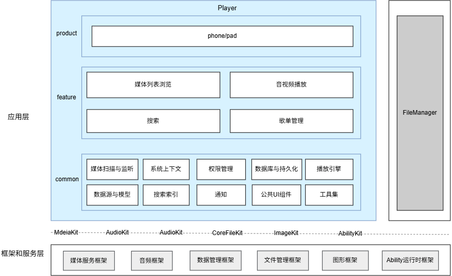

# 播放器（Player）

## 简介

**播放器**（包名：`com.ohos.players`）是 OpenHarmony 中预置的**系统应用**，提供媒体列表浏览、音视频播放、歌单管理与搜索等能力，适配手机、平板设备形态。

本应用为系统预置应用，用户可从桌面图标、文件管理器「打开方式」等场景进入播放器。

### 核心能力

**媒体列表浏览**
- 自动扫描设备内音频与视频文件，支持媒体库扫描、沙箱扫描、公共目录扫描、用户文件扫描多种策略。
- 批量导入时进度条实时更新，后台/锁屏场景显示进度通知。
- 全部/音乐/视频分类 Tab 切换筛选，宫格与列表两种布局模式切换，支持按大小、时间、名称排序。
- 音视频缩略图展示（视频首帧/音频封面），列表项字体与缩放跟随系统设置。
- 支持单选删除、多选删除与滑动多选删除。

**音视频播放**
- 支持本地路径播放，点击音频/视频文件进入对应播放页并自动起播。
- 播放模式：顺序播放、列表循环、单曲循环、随机播放。
- 倍速播放多档可选，音频无杂音，视频音画同步。
- 视频横竖屏自动适配，播放不中断；音频页支持收起为迷你播放条。
- 手势调节亮度与音量、长按临时倍速。
- 播控中心（AVSession）展示封面与播控按钮，支持后台音频播放与通知栏提示。
- 视频画中画（PiP）悬浮小窗继续播放，支持分屏模式。
- 来电监听自动暂停/恢复播放，锁屏监听暂停/恢复视频。
- 支持从文件管理器「打开方式」直接唤起播放器并播放音视频文件。

**歌单管理**
- 支持创建多个命名歌单并独立维护曲目。
- 歌单内支持多选删除、长按拖动排序。
- 歌单断点续播：进程终止后音频续播进度。

**搜索**
- 首页搜索入口，按文件名关键词模糊匹配，基于内存倒排索引实现高效检索。
- 命中结果按评分排序展示，支持高亮标记，点击跳转对应播放页。

## 架构说明

播放器采用分层与模块化设计，按产品形态、业务特性与公共能力组织代码，如图：


### 应用层分层设计

整体可划分为产品层、特性层、公共层：

| 层次 | 主要目录 | 说明                                                                                |
|------| -------------- |-----------------------------------------------------------------------------------|
| 产品层 | `entry` | 手机、平板同一hap入口：承载应用入口、主页面、Ability 生命周期与页面导航。                                        |
| 特性层 | `feature/media`、`feature/player`、`feature/search`、`feature/playlist` | 媒体列表浏览、音视频播放、搜索、歌单管理。                                                             |
| 公共层 | `common` | 媒体扫描与监听、系统上下文、权限管理、数据库与持久化、播放引擎、数据源与模型、搜索索引、通知、公共UI组件、工具集。 |

**产品层模块说明**

| 目录 / 组件 | 说明 |
|-------------|------|
| `abilities/` | `MainAbility` 入口，承载 UIAbility 生命周期 |
| `pages/` | 首页、默认索引页、歌单页等主页面 |
| `pages/nav/` | NavDestination 子页面，包括音频/视频/搜索/设置等 |
| `navigation/` | NavPathStack 路由表与页面注册 |
| `components/` | 首页组件，包括顶栏、分类 Tab、浮动 Tab 栾等 |
| `viewmodel/` | 页面级业务编排，包括首页与歌单的 ViewModel |
| `constants/` | 路由名称、视图尺寸等常量 |
| `utils/` | 外部 Want 解析、导航跳转等工具 |

**特性层模块说明**

| 核心能力 | 关键类                                                                                                                                                                                      | 说明                      |
|--------|------------------------------------------------------------------------------------------------------------------------------------------------------------------------------------------|-------------------------|
| 媒体列表浏览 | MediaAggregateView、MediaAggregateViewModel、MediaViewArrayDataSource                                                                                                                      | 媒体列表/宫格视图、多策略扫描编排、筛选排序、多选删除         |
| 音视频播放 | AudioPage/VideoPlayPage、AVPlayerController/AudioPlayerController/VideoPlayerController、AudioPlaybackSession/VideoPlaybackSession、PlaybackCallInterruptGuard/PlaybackVideoScreenLockGuard | 音频/视频播放页、AVSession 桥接、手势交互、PiP、来电/锁屏监听 |
| 歌单管理 | PlaylistView/PlaylistDetailView/PlaylistEditView、PlaylistAddAudioView                                                                                                                    | 歌单列表/详情/编辑、曲目增删排序、断点续播         |
| 搜索 | SearchBar/SearchOverlay、SearchViewModel、SearchIndexCoordinator                                                                                                                           | 倒排索引、评分排序、结果高亮              |

**公共层模块说明**

| 核心能力 | 关键类                                                                                       | 说明                                                |
|--------|-------------------------------------------------------------------------------------------|---------------------------------------------------|
| 媒体扫描与监听 | MediaFileScanner、ScanStateManager、ScanTaskPool、FileListenerManager、FileSyncEngine         | 统一发现设备内媒体文件并维护扫描状态，扫描结果全局共享                       |
| 系统上下文 | AppContext、IMediaListAccess                                                               | 全局单例持有 ability context 与依赖注入桥接，跨 feature 统一获取系统资源 |
| 权限管理 | MediaPermissionManager                                                                    | 封装系统权限 API 并维护全局授权状态，保证各场景权限请求一致                  |
| 数据库与持久化 | MediaDbManager、Rdb、PlaybackHistoryManager、AppLocalStorage                                 | 统一数据库句柄与表访问层，收敛数据写入入口                             |
| 播放引擎 | PlaybackQueueManager、PlaybackResumeContext                                                | 播放队列与续播状态是跨页面的全局运行态，集中管理以保证切歌与续播在多入口下一致           |
| 数据源与模型 | MediaDataSource、IMediaDataSource、FileInfo、AudioItem、VideoItem、MediaCacheManager           | 定义各 feature 共用的数据模型                               |
| 搜索索引 | SearchIndexManager                                                                        | 倒排索引构建与检索，索引数据全局维护                                |
| 通知 | MediaProgressNotificationHelper、MediaProgressBackgroundHelper、MediaProgressLiveViewHelper | 统一通知渠道与样式                                         |
| 公共UI组件 | EmptyStateView、SearchBar、NavBackButton、SwipeDeleteEndAction                               | 无业务状态的纯展示控件，如搜索框、按钮，可被任意页面组合                      |
| 工具集 | MediaMetadataResolver、SearchScorer、ThumbnailManager、DeviceConfigUtil、AppThemeConstants    | 无状态纯函数工具，任意模块可调用，含元数据解析、缩略图加载、拼音转换缓存等                                  |

### 与其它应用的关系

允许系统侧应用调用本应用。前提是本应用已安装，且播放音视频需用户授权对应媒体权限。

按场景说明：

| 场景 | 说明                                                                                               |
|------|--------------------------------------------------------------------------------------------------|
| 用户在文件管理器用「打开方式」播放音视频 | 用户在文件管理器选中音视频文件后选择「打开方式 → 播放器」时，文件管理器通过 Want 携带文件 URI 拉起本应用 MainAbility，播放器解析 URI 后进入对应播放页并开始播放。 |
| 播控中心控制播放 | 播放器正在播放时，用户从状态栏下拉播控中心；播放器事先通过 AVSession 向系统注册了媒体会话，播控中心读取该会话的播放信息，并通过会话回调向本应用下发播放、暂停、切歌等命令。      |
| 锁屏卡片控制播放 | 播放器正在播放时用户锁屏；锁屏应用同样通过 AVSession 读取本应用的会话信息，在锁屏界面展示封面与播控按钮，用户的操作经会话回调传回本应用执行。                     |
| 后台音频播放 | 用户播放音频后将播放器切到后台，播放器可继续在后台输出音频；同时通过 AVSession 持续上报播放状态，通知栏展示播放通知，用户点击通知可回到播放页。                    |

## 编译构建

本工程为多模块 HAR + HAP 应用工程，使用 Hvigor 构建，产物为 `com.ohos.players` 系统应用包。

### 环境要求
- Openharmony SDK: compileSdkVersion 26, compatibleSdkVersion 23
- DevEco Studio 或命令行 Hvigor 工具链
- 系统签名证书（见 `signature/`）

### 编译命令

在工程根目录执行：

```bash
# 使用 DevEco Studio 打开工程后执行 Build，或使用 hvigor 命令行
hvigorw assembleHap
```

## 播放器开发

播放器采用 **ArkTS** 语言开发，UI 基于 ArkUI Stage 模型。应用通过 `MainAbility` 承载主界面，通过 `feature/media` / `feature/player` 完成媒体浏览与播放业务，并通过 `common` 保持数据、扫描与播放引擎能力。开发可参考：[ArkUI 开发概述](https://gitcode.com/openharmony/docs/blob/master/zh-cn/application-dev/ui/arkts-ui-development-overview.md)

### 基于已有模块的开发

适用场景：对已有能力做功能定制，例如调整扫描策略、扩展播放页交互、修改歌单排序、优化搜索体验等。

明确改动点：按业务边界定位到 `entry`（入口与首页）、`feature/media`（媒体列表）、`feature/player`（播放）、`feature/playlist`（歌单）、`feature/search`（搜索）或 `common`（公共能力）。

以下列举一些常见的修改场景：

**场景1：修改媒体列表链路**
   - 页面入口位于 `feature/media/src/main/ets/components/MediaAggregateView.ets`
   - 业务逻辑位于 `feature/media/src/main/ets/manager/MediaAggregateViewModel.ets`

    例如，需在媒体列表加载完成后新增自定义处理，可在`MediaAggregateViewModel.loadMediaFiles()`的回调后添加相关逻辑：
    ```typescript
    // MediaAggregateViewModel.ets — loadMediaFiles 是媒体列表加载入口
    public async loadMediaFiles(mediaType: MediaType, forceRefresh: boolean = false) {
      if (!this.isReady()) {
        return;
      }
      this.isLoading = true;
      try {
        // 原有流程：权限检查 → 数据源加载 → 回调通知
        await this.mediaDataSource.loadMediaFiles(mediaType, forceRefresh);
        // 新增处理逻辑
        this.onMediaLoadComplete(mediaType);
      } finally {
        this.isLoading = false;
      }
    }
    ```
**场景2：修改播放链路**

   - 页面入口位于 `feature/player/src/main/ets/pages/AudioPage.ets`（音频）、`feature/player/src/main/ets/pages/VideoPlayPage.ets`（视频）
   - 播放控制位于 `feature/player/src/main/ets/controller/AVPlayerController.ets`
   - 会话管理位于 `feature/player/src/main/ets/session/AudioPlaybackSession.ets` / `VideoPlaybackSession.ets`

    例如，需调整倍速控制逻辑，在`AVPlayerController.setSpeed()`中扩展：
    ```typescript
    // AVPlayerController.ets — 倍速控制
    setSpeed(speed: number): void {
      const playbackRate = this.resolvePlaybackRate(speed);
      HiLog.i(TAG, `setSpeed: ${speed} playbackRate=${playbackRate}`);
      // 新增倍速前参数校验
      if (speed > this.maxSpeed) {
        HiLog.w(TAG, `Speed ${speed} exceeds limit ${this.maxSpeed}`);
        return;
      }
      this.speed = speed;
      if (this.avPlayer !== null && AVPLAYER_PREPARED_STATE.has(this.avPlayer.state as string)) {
        this.avPlayer.setPlaybackRate(playbackRate);
      }
      this.setPlayingSpeed(playbackRate);
    }
    ```   
**场景3：修改歌单链路**
   - 页面入口位于 `feature/playlist/src/main/ets/components/PlaylistDetailView.ets`
   - 业务编排位于 `entry/src/main/ets/viewmodel/PlaylistViewModel.ets`
   - 数据持久化位于 `common/src/main/ets/persistence/rdb/MediaDbManager.ets`

    例如，若需在创建歌单时新增名称校验，修改 `PlaylistViewModel.submitNameDialog()`：
    ```typescript
    // PlaylistViewModel.ets — 提交歌单名称
    public async submitNameDialog(name: string): Promise<void> {
      // 新增名称长度校验
      if (name.length === 0 || name.length > 30) {
        HiLog.w(TAG, `Invalid playlist name length: ${name.length}`);
        return;
      }
      // 原有流程：创建/重命名 → 数据库写入 → 列表刷新
      await this.executeNameAction(name);
      await this.loadPlaylists();
      this.closeNameDialog();
    }
    ```
**场景4：修改搜索链路**
   - 页面入口位于 `feature/search/src/main/ets/components/SearchOverlay.ets`
   - 业务逻辑位于 `feature/search/src/main/ets/viewmodel/SearchViewModel.ets`
   - 搜索索引位于 `common/src/main/ets/search/SearchIndexManager.ets`

    例如，需调整搜索结果评分权重，修改`SearchScorer`中的评分逻辑：
    ```typescript
    // SearchScorer.ets — 搜索评分算法
    public static scoreFile(file: FileInfo, keywords: string[]): MatchResult {
      let totalScore: number = 0;
      for (const keyword of keywords) {
        // 调高文件名匹配权重
        const nameMatch = SearchMatchEngine.matchText(fileName, keyword.toLowerCase());
        if (nameMatch.matched && nameMatch.score > 0) {
          totalScore += nameMatch.score * SearchScorer.FIELD_WEIGHT_FILE_NAME / 100;
          matchedKeywords.push(keyword);
        }
      }
      return { score: totalScore, matchedKeywords: matchedKeywords, highlightRanges: highlightRanges };
    }
    ```
**场景5：修改UI组件**
   - 首页组件位于 `entry/src/main/ets/components/`。
   - 通用组件位于 `common/src/main/ets/component/`。

    例如，需要全局调整空状态样式，直接修改`EmptyStateView`：
    ```typescript
    // EmptyStateView.ets — 全局空状态组件
    @Component
    export struct EmptyStateView {
      @Prop icon: Resource = $r('app.media.ic_empty_state');
      @Prop title: ResourceStr = '';
      @Prop description: ResourceStr = '';
      @Prop fullHeight: boolean = false;
    
      build() {
        Column({ space: 16 }) {
          Image(this.icon)
            .width(200)
            .height(200)
          Text(this.title)
            .fontSize(16)
            .fontColor($r('sys.color.ohos_id_color_text_secondary'))
          Text(this.description)
            .fontSize(14)
            .fontColor($r('sys.color.ohos_id_color_text_tertiary'))
        }
        .width('100%')
        .height(this.fullHeight ? '100%' : 300)
        .justifyContent(FlexAlign.Center)
      }
    }
    ```   

常用修改入口：

| 目标     | 路径                                                                                                  |
|--------|-----------------------------------------------------------------------------------------------------|
| 应用首页   | `entry/src/main/ets/pages/MainPage.ets`                                                        |
| 媒体列表   | `feature/media/src/main/ets/components/MediaAggregateView.ets`                                             |
| 媒体列表 ViewModel | `feature/media/src/main/ets/manager/MediaAggregateViewModel.ets`                                        |
| 音频播放页  | `feature/player/src/main/ets/pages/AudioPage.ets`                                            |
| 视频播放页 | `feature/player/src/main/ets/pages/VideoPlayPage.ets`、`feature/player/src/main/ets/controller/VideoPlayerController.ets` |
| 歌单管理 | `feature/playlist/src/main/ets/components/PlaylistDetailView.ets` |
| 搜索页面   | `feature/search/src/main/ets/components/SearchOverlay.ets`                                    |
| 播放引擎（队列/历史/续播） | `common/src/main/ets/player/`、`common/src/main/ets/persistence/` |
| 扫描器 | `common/src/main/ets/scan/` |
| 数据库 | `common/src/main/ets/persistence/rdb/MediaDbManager.ets` |
| 缩略图 | `common/src/main/ets/thumbnail/ThumbnailManager.ets` |
| UI组件   | `entry/src/main/ets/components/`、`common/src/main/ets/component/`                          |

### 新特性能力的开发

下面用 **「新增一种播放相关业务能力（示意：睡眠定时关闭播放）」** 串起完整步骤，以及前后依赖关系。

> **说明**：当前工程采用 `entry + feature + common` 多模块结构，产品入口为 `entry`。一般新业务落在已有 feature；若新增独立产品形态 HAP，可在 `build-profile.json5` 中注册对应模块。

#### 目标业务（示例）

希望用户能：在播放页设置「定时 30 分钟后停止播放」→ 到点自动暂停并退出播放。因此需要同时具备：**业务数据与播放控制链路**、**暴露给用户的入口**、**用户可操作的 UI**。三步对应这三条能力链路，顺序一般是 **先业务 → 再入口 → 后 UI**。

**步骤1：扩展业务能力**

| 要解决的问题 | 说明 |
|--------------|----------------|
| 定时设置要能持久化 | 在 `common` 的 `persistence/rdb` 中扩展表或字段，并经 `MediaDbManager` 暴露；否则重启后设置丢失 |
| 到点要能停止播放 | 在 `feature/player` 的控制器（如 `AVPlayerController`）中扩展定时停止逻辑，并联动 `PlaybackQueueManager` 与 AVSession 状态 |
| 新 Feature HAR 时 | 按 MVVM 拆分 View / ViewModel；在 `feature/<module>/oh-package.json5` 声明对 `@ohos/common` 的依赖；在 `feature/<module>/Index.ets` 导出对外 API；并在 `entry/oh-package.json5` 增加依赖声明 |

开发流程建议：

1. 在特性层落实持久化与播放控制逻辑（`feature/player`、`common/persistence`）。
2. 若能力足够独立，也可新建 `feature/xxx` HAR，在 `build-profile.json5` 与 `entry/oh-package.json5` 声明依赖。
3. 在 `entry/src/ohosTest` 中补充对应 UT / DT 用例。

**步骤2：配置 / 确认 Ability 入口（让系统能「找得到」本能力）**

业务逻辑若在 HAR 内，**外部仍只会拉起 `entry` 里声明的 Ability**。因此要核对 `entry/src/main/module.json5`：

- 现有 `MainAbility` 是否覆盖场景；新场景若需新的 Ability / skills / Want 过滤器，在此声明，否则外部 Want **无法拉起**。
- 权限是否足够：例如后台定时仍依赖 `KEEP_BACKGROUND_RUNNING`，通知依赖 `NOTIFICATION_CONTROLLER`。

现有入口示意：

    ```json
    {
      "module": {
        "name": "entry",
        "type": "entry",
        "mainElement": "MainAbility",
        "deviceTypes": [
          "default",
          "tablet"
        ],
        "abilities": [
          {
            "name": "MainAbility",
            "srcEntry": "./ets/abilities/mainability/MainAbility.ets",
            "exported": true,
            "skills": [
              {
                "entities": ["entity.system.home"],
                "actions": ["ohos.want.action.home"]
              },
              {
                "entities": ["entity.system.browsable", "entity.system.default"],
                "actions": ["ohos.want.action.viewData"],
                "uris": [
                  { "scheme": "file", "type": "audio/*" },
                  { "scheme": "file", "type": "video/*" }
                ]
              }
            ]
          }
        ],
        "requestPermissions": [
          { "name": "ohos.permission.READ_AUDIO" },
          { "name": "ohos.permission.WRITE_AUDIO" },
          { "name": "ohos.permission.READ_IMAGEVIDEO" },
          { "name": "ohos.permission.WRITE_IMAGEVIDEO" },
          { "name": "ohos.permission.FILE_ACCESS_MANAGER" },
          { "name": "ohos.permission.INTERNET" },
          { "name": "ohos.permission.KEEP_BACKGROUND_RUNNING" },
          { "name": "ohos.permission.NOTIFICATION_CONTROLLER" }
        ]
      }
    }
    ```

**步骤3：定制 UI**

在业务数据与 Ability 可达之后，再改页面把能力暴露给用户，例如：

| UI | 位置 | 用途 |
|----|------|------|
| 播放页新增「睡眠定时」入口 | `feature/player/src/main/ets/pages/AudioPage.ets` / `VideoPlayPage.ets` | 弹出定时选项 |
| 定时选项半模态 | `entry/src/main/ets/pages/nav/` 新增 NavDestination | 选择时长并写入步骤1 的持久化 |
| 播放队列面板状态同步 | `feature/player/src/main/ets/datasource/` | 展示剩余时长 |

新增独立页面时：

1. 在 `entry/src/main/ets/pages/nav/` 下新增 NavDestination 包装页，业务 UI 放在对应 Feature；
2. 在 `entry/src/main/ets/navigation/AppNavPageMap.ets` 中注册路由；
3. 在 `entry/src/main/ets/constants/AppNavRoutes.ets` 中增加路由名称常量；
4. 通过 `NavRouterHelper` 统一导航跳转。

## 目录
```text
applications_players
├─AppScope                              # 应用级配置与多语言资源
│  ├─app.json5                          # bundleName、版本号等
│  └─resources/                         # 全局字符串 / 图标等资源
├─entry                                 # 产品层，承载应用入口、主页面与页面导航
│  └─src/main/ets/
│     ├─abilities/                      # Ability 入口与 UIAbility 生命周期管理
│     ├─pages/                          # 首页、默认索引页、歌单页等主页面
│     ├─pages/nav/                      # NavDestination 子页面，包括音频/视频/搜索/设置等
│     ├─navigation/                     # NavPathStack 路由表与页面注册
│     ├─components/                     # 首页组件，包括顶栏、分类 Tab、浮动 Tab 栏等
│     ├─viewmodel/                      # 页面级业务编排，包括首页与歌单的 ViewModel
│     ├─constants/                      # 路由名称、视图尺寸等常量
│     └─utils/                          # 外部 Want 解析、导航跳转等工具
├─feature                               # 特性层
│  ├─media/                             # 媒体列表浏览
│  │  └─src/main/ets/
│  │     ├─components/                  # 列表与宫格视图组件
│  │     ├─manager/                     # 媒体列表业务编排与状态管理
│  │     ├─constants/                   # 布局模式、排序规则、UI 尺寸等常量
│  │     ├─datasource/                  # 媒体列表数据源适配
│  │     └─utils/                       # 排序项展示等工具
│  ├─player/                            # 音视频播放
│  │  └─src/main/ets/
│  │     ├─pages/                       # 音频播放页、视频播放页
│  │     ├─component/                   # 视频播放器等播放器组件
│  │     ├─controller/                  # 播放控制，包括音频/视频/通用播放控制器
│  │     ├─session/                     # AVSession 媒体会话与后台播放管理
│  │     ├─viewmodel/                   # 视频播放与画中画业务编排
│  │     ├─view/                        # 标题栏、工具按钮等视图组件
│  │     ├─datasource/                  # 播放队列数据源适配
│  │     ├─utils/                       # 窗口模式、视频布局等工具
│  │     └─constants/                   # 播放控制、画中画、UI 尺寸等常量
│  ├─playlist/                          # 歌单管理
│  │  └─src/main/ets/
│  │     ├─components/                  # 歌单列表、详情、编辑等组件
│  │     ├─datasource/                  # 歌单列表与曲目数据源适配
│  │     ├─model/                       # 歌单数据模型
│  │     ├─constants/                   # 歌单 UI 常量，包括卡片样式、网格布局、名称输入弹窗等
│  │     └─utils/                       # 歌单名称输入校验等工具
│  └─search/                            # 搜索
│     └─src/main/ets/
│        ├─components/                  # 搜索浮层、搜索结果项等组件
│        ├─viewmodel/                   # 搜索业务编排
│        ├─manager/                     # 搜索索引协调管理
│        ├─utils/                       # 搜索偏好配置等工具
│        └─constants/                   # 搜索 UI、偏好等常量
├─common                                # 公共能力层
│  └─src/main/ets/
│     ├─bridge/                         # 依赖注入桥接接口
│     ├─cache/                          # 媒体列表缓存管理
│     ├─component/                      # 通用 UI 组件，包括空状态、搜索栏、返回按钮等
│     ├─constants/                      # 主题、播放器、支持的媒体格式等常量
│     ├─context/                        # 全局上下文持有者
│     ├─datasource/                     # 数据源抽象与实现
│     ├─listener/                       # 文件监听与同步引擎
│     ├─model/                          # 数据模型，包括音频项、视频项、文件信息等
│     ├─notification/                   # 通知管理，包括进度通知等
│     ├─permission/                     # 权限管理
│     ├─persistence/                    # 持久化，包括数据库管理、播放历史、显示设置等
│     ├─player/                         # 播放引擎，包括播放队列管理、AVPlayer 管理等
│     ├─scan/                           # 扫描任务调度，包括扫描器、状态管理、任务池等
│     ├─search/                         # 倒排索引与搜索索引管理
│     ├─storage/                        # 全局本地存储
│     ├─thumbnail/                      # 缩略图多级缓存，包括磁盘缓存与内存缓存
│     └─utils/                          # 通用工具，包括日志、元数据解析、设备配置等
├─hvigor                                # 构建工具配置
├─signature                             # 签名证书与 profile
├─figures                               # 架构/构建文档图片
├─build-profile.json5                   # 工程级配置
├─oh-package.json5
├─README.md                             # 英文说明文档
└─README_zh.md                          # 中文说明文档
```

## 约束
- **语言版本**：ArkTS
- **运行形态**：系统预置应用（`com.ohos.players`），依赖媒体播放、文件访问等系统能力
- **设备类型**：手机、平板（见 `entry/src/main/module.json5`）
- **形态适配**：横竖屏、PiP、分屏等会改变页面布局，修改 UI 时需覆盖多形态验证
- **权限**：播放器所需的主要权限如下（见 `entry/src/main/module.json5`）

  | 权限 | 授权方式 | 使用场景 |
  |------|---------|------|
  | ohos.permission.READ_AUDIO | 用户授权 | 读取音频文件元数据与内容，供媒体列表扫描与播放 |
  | ohos.permission.WRITE_AUDIO | 用户授权 | 创建/管理音频文件 |
  | ohos.permission.READ_IMAGEVIDEO | 用户授权 | 读取视频文件元数据与内容 |
  | ohos.permission.WRITE_IMAGEVIDEO | 用户授权 | 创建/管理视频文件 |
  | ohos.permission.KEEP_BACKGROUND_RUNNING | 系统授权 | 后台音频播放与媒体扫描任务保活，避免进程被挂起 |
  | ohos.permission.NOTIFICATION_CONTROLLER | 系统授权 | 播放通知与扫描进度通知，供播控中心与锁屏卡片展示 |

- **支持的媒体格式**：音频（m4a、aac、mp3、ogg、wav、amr）、视频（mp4、mkv、ts）


## 参与贡献

欢迎广大开发者贡献代码、文档等，具体的贡献流程和方式请参见[参与贡献](https://gitcode.com/openharmony/docs/blob/master/zh-cn/contribute/%E5%8F%82%E4%B8%8E%E8%B4%A1%E7%8C%AE.md)。
